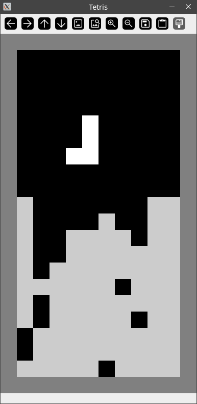

# opencv-tetris

Tetris written in Python using OpenCV
(just for fun)




## How to play

```sh
pip install -r requirements.txt
python3 tetris.py
```

Controls:
- <kbd>A</kbd> or <kbd>Left arrow</kbd> — move the piece to the left
- <kbd>D</kbd> or <kbd>Right arrow</kbd> — move the piece to the right
- <kbd>W</kbd> or <kbd>Up arrow</kbd> — rotate the piece 
- <kbd>S</kbd> or <kbd>Down arrow</kbd> — drop the piece
- <kbd>Esc</kbd> — exit the game

**Important:**
The window closing button does not work! Use the <kbd>Esc</kbd> key.


## Scoring

- 1 line — 1 point
- 2 lies at once — 4 points
- 3 lies at once — 9 points
- 4 lies at once — 16 points


## TO DO

- [ ] More accurate rotation
- [ ] Partial drop
- [ ] CLI arguments (speed, scale)
